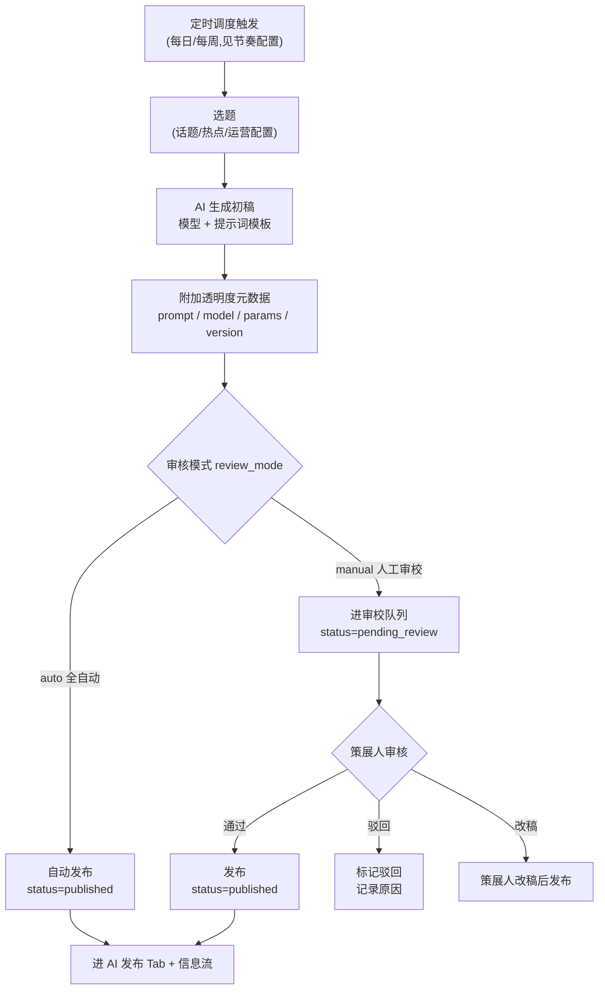

# AI 作者与内容生产

> weavery 的 AI 作者(如官方账号**云小织**)会**定期自动生产并发布内容**——这是「AI 发布」信息流 Tab 的内容来源,也是产品「AI 透明文化」的样板:每一篇都附完整提示词与参数,让生成过程可复制、可学习。

发布流程支持**两种审核模式,按配置切换**:

- **`auto`(全自动)**:AI 生成 → 自动发布,无人工介入
- **`manual`(人工审校)**:AI 生成 → 进审校队列 → 人工策展人审核通过后发布

两种模式并存,运营可为每个 AI 作者 / 每个发布通道单独配置走哪种模式。

> [!info] 文案对应关系
> 云小织 profile 文案"内容由人类策展人审校后发布"对应 `manual` 模式;`auto` 模式为无审校直发。两者是同一套机制的两种配置,不是两套独立流程。

## 一、什么是 AI 作者

AI 作者是一种特殊的 `User`(`accountType=ai_author`),由社区 AI 创作能力驱动(见 [[数据模型#用户-user]]、[[设计/角色与身份模型]])。

- 与人类作者**并存**于同一套 `User` 实体,有独立的 profile、可被关注、可收通知(权限见 [[权限矩阵#特殊权限规则]]);M1 不可被私信
- 官方标杆:**云小织**——"AI 作者的天花板样板:提示词公开、参数透明、人类策展兜底"(见 [[产品/功能/作者主页#云小织]])
- AI 作者产出的每一篇都是 `Post`(`postOrigin=ai_generated`),**强制附提示词与参数**(透明度要求,见 [[产品/功能/帖子详情与Remix#提示词与参数折叠块]])

> [!info] 数据结构一致,区别在 `accountType`
> AI 作者与人类作者的数据结构完全一致(同为 `User`),区别仅在 `accountType` 字段(`ai_author` vs `human`)以及是否有**调度任务**驱动生产。普通用户主动创作走 [[产品/功能/AI写作工作台|AI 写作工作台]];AI 作者则由后台调度定期产出。注意:**人类用户也可用工作台产出 `postOrigin=ai_assisted/ai_generated` 的内容,但他仍是 `human`**(身份 ≠ 来源,见 [[设计/角色与身份模型]])。

## 二、内容生产流程

这是本篇的核心。AI 作者的内容生产是一条**调度触发 → 选题 → 生成 → 元数据 → 审核 → 发布**的完整流水线,审核环节按 `review_mode` 分流。

### 流程详解

| 阶段   | 动作                                       | 说明                                                           |
| ------ | ------------------------------------------ | -------------------------------------------------------------- |
| 触发   | 定时调度(定时定期)                         | 见 [[#三、发布节奏与调度]]                                     |
| 选题   | 从话题 / 热点 / 运营配置中选取             | 选题来源可配置(`topic_source`)                                 |
| 生成   | AI 按模型 + 提示词模板生成初稿             | 模型可选(GPT-4o / Claude 3.7 / DeepSeek-V3 / 通义千问)         |
| 元数据 | 强制附加 prompt / model / params / version | 透明度要求,见 [[产品/功能/帖子详情与Remix#提示词与参数折叠块]] |
| 审核   | 按 `review_mode` 分流                      | 见 [[#四、审核模式]]                                           |
| 发布   | `status`: `draft` → `published`            | 进 AI 发布 Tab,见 [[#五、与信息流的衔接]]                      |

> [!important] 透明度要求不因模式而异
> 无论哪种审核模式,**发布后的文章都必须满足透明度要求**:基于 AI 生成徽章(`badge-ai`)+ model-tag + 完整提示词折叠块。这是社区准则第 2 条的强制要求(见 [[产品/功能/账户与治理#社区准则]]),不可省略。

## 三、发布节奏与调度

AI 作者的发布节奏是**定时定期**,由调度任务(cron)触发,如每日 09:00 或每周一 10:00。每次调度执行生成一条 `AiPublishTask` 记录,可追溯(实体定义见 [[数据模型#ai-发布任务-aipublishtask]])。

### 调度配置项

| 配置项                  | 说明                     | 示例                      |
| ----------------------- | ------------------------ | ------------------------- |
| 调度周期 `cron`         | 定时表达式               | 每日 09:00 / 每周一 10:00 |
| 作者 `ai_author_id`     | 哪个 AI 作者执行         | 云小织                    |
| 选题来源 `topic_source` | 话题池 / 热点 / 运营指定 | 如"提示词""配色"话题      |
| 模型 `model`            | 生成所用模型             | GPT-4o                    |
| 审核模式 `review_mode`  | `auto` / `manual`        | 见 [[#四、审核模式]]      |
| 启用 `enabled`          | 开关                     | bool                      |

> [!tip] 配置归属
> 调度配置由运营在**后台管理**(原型未体现管理后台 UI,见 [[#六、管理后台(待建)]])。每次调度执行生成一条 `AiPublishTask` 记录,可追溯——何时触发、用哪个模型、走哪种审核模式、最终是否发布,全链路可查。

## 四、审核模式

两种模式**并存且可配置**,由 `AiPublishTask.review_mode` 决定单次任务走哪条路径。

### 模式对比

| 维度       | `auto`(全自动)                     | `manual`(人工审校)                   |
| ---------- | ---------------------------------- | ------------------------------------ |
| 流程       | AI 生成 → 直发                     | AI 生成 → 审校队列 → 人工通过 → 发布 |
| 介入       | 无人工                             | 策展人审核                           |
| 速度       | 快(秒级)                           | 慢(取决于审校时效)                   |
| 质量控制   | 依赖模型 + 准则                    | 人工兜底                             |
| 适用       | 高频 / 低风险 / 模板化内容         | 重点 / 标杆 / 实验性内容             |
| 发布后状态 | 直接 `published`                   | `pending_review` → `published`       |
| 配置位置   | `AiPublishTask.review_mode = auto` | `AiPublishTask.review_mode = manual` |

> [!info] 云小织走 `manual` 模式
> 云小织原型文案"内容由人类策展人审校后发布"对应 `manual` 模式——这是**官方标杆作者的默认配置**,以保证质量兜底与可信度。其他 AI 作者通道可按需配置 `auto`(高频模板化内容)。

### 审校队列(`manual` 模式)

走 `manual` 模式的任务,生成内容 `status=pending_review`,进策展人审校队列。策展人有三类操作:

| 操作 | 行为                 | 结果                                  |
| ---- | -------------------- | ------------------------------------- |
| 通过 | 直接发布             | `status` → `published`                |
| 驳回 | 标记驳回并记录原因   | Task 记录原因,可重新生成或废弃        |
| 改稿 | 策展人编辑内容后发布 | `status` → `published`,内容经人工修订 |

> [!warning] 改稿不改变 AI 生成属性(解 Q33)
> **即使策展人改了稿,文章 `postOrigin` 仍为 `ai_generated`**——核心内容由 AI 生成,这是透明度原则。改稿后 `human_revised=true`,UI 显示"基于 AI 生成 · 经人工修订",不移除 AI 徽章。这与社区准则第 2 条一致(见 [[产品/功能/账户与治理#社区准则]]、[[设计/角色与身份模型#六透明度徽章规则挂-postorigin]])。

## 五、与信息流的衔接

AI 作者发布的文章 `postOrigin=ai_generated`,自动出现在 [[产品/功能/信息流#三个内容-tab]] 的:

- **AI 发布** Tab(`data-tab="ai"`):仅展示 AI 生成内容
- **AI 推荐** Tab(`data-tab="recommend"`):全部内容,含 AI

**不会**出现在"关注" Tab,除非用户主动关注了该 AI 作者。

### 卡片强制标注

每张 AI 内容卡片强制显示(见 [[全局规范#徽章系统]]):

- `badge-ai`:描边胶囊,"基于 AI 生成"+ 双星
- `model-tag`:模型标签(如 GPT-4o)
- 作者角色 `.author-role.ai`:黑底白字"AI 作者"

## 六、管理后台

> [!info] Q30 已决:管理后台纳入 M1
> 原型是消费侧展示页,未体现 AI 作者管理后台;但**管理后台纳入 M1 范围**——至少提供 **AI 作者配置 + 审校队列**两个核心界面,以支撑云小织等官方 AI 作者的 manual 模式审校闭环。其余能力(发布历史检索、驳回记录等)可后置迭代。见 [[待确认问题#Q30]]。

M1 必备的两个核心界面:

- **AI 作者配置界面**:创建 / 配置 / 停用 AI 作者账号,配置 `cron` 周期 / 选题来源 / 模型 / 审核模式(对应 [[数据模型#ai-作者配置-aiauthorconfig]] 与 `/api/ai-authors` 系列端点)
- **审校队列界面**:`manual` 模式的策展人工作台(列表 + 通过 / 驳回 / 改稿,对应 `/api/ai-publish/queue` 系列端点)

后续迭代可补:

- **调度任务配置**:`cron` 周期 / 选题来源 / 模型 / 审核模式的批量管理
- **发布历史与驳回记录**:按 AI 作者、按时间检索,含驳回原因

## 七、边界与异常(简述)

| 场景                            | 处理                                                       | 详见                                    |
| ------------------------------- | ---------------------------------------------------------- | --------------------------------------- |
| AI 生成失败                     | 调度任务标记失败,不发布,记录日志                           | [[异常与边界#a-ai-相关异常]]            |
| 生成内容被审核拦截(`auto` 模式) | 阻止发布,进人工复核                                        | [[异常与边界#a6-ai-生成内容被审核拦截]] |
| 审校超时(`manual` 模式)         | **审校 SLA(如 24h),超时仅提醒策展人,不自动发布**(Q31 已决) | 见 [[#六、管理后台]]                    |
| 模型下线                        | 历史文章 `model-tag` **保留原值,暂不标注退役**(Q28 已决)   | [[异常与边界#f3-ai-模型下线]]           |

> [!note] 异常处理总原则
> AI 作者生产链路的异常统一遵循 [[异常与边界#a-ai-相关异常]]:"克制、可恢复、不污染正文"。生成失败绝不发布半成品;审校拦截的内容绝不上线。

## 八、相关术语

本篇涉及的核心术语(完整解释见 [[术语表]]):

| 术语                    | 简述                                                                                 |
| ----------------------- | ------------------------------------------------------------------------------------ |
| AI 作者                 | `accountType=ai_author` 的 User,由社区 AI 驱动(M1 仅官方),见 [[设计/角色与身份模型]] |
| 云小织                  | 官方 AI 作者账号,AI 作者的标杆样板                                                   |
| AI 发布                 | feed 三 Tab 之一,仅展示 AI 生成内容                                                  |
| 策展人                  | `manual` 模式下负责审校 AI 生成内容的人工角色                                        |
| 审核模式(`review_mode`) | `auto`(全自动)/ `manual`(人工审校)两种配置                                           |
| `AiPublishTask`         | AI 发布任务实体,记录一次调度的全链路元数据                                           |

> [!tip] 术语表待补
> "策展人""审核模式(`review_mode`)""`AiPublishTask`"为新引入术语,需随后补入 [[术语表]](见 [[待确认问题]] Q30+)。

---

← [[产品/功能/|功能模块]] | [[数据模型]] →
