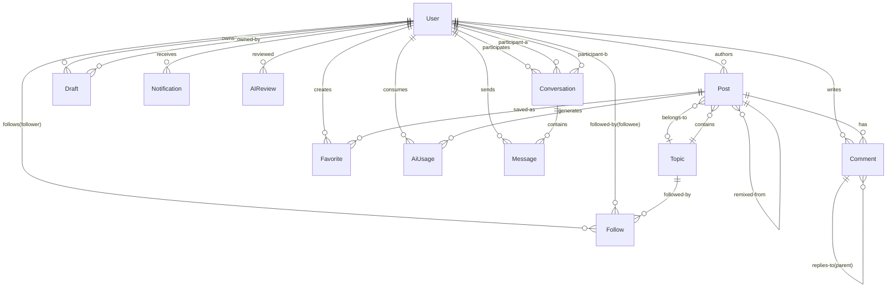
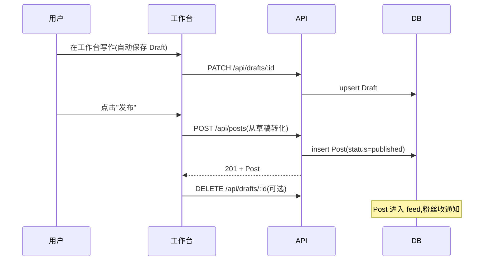
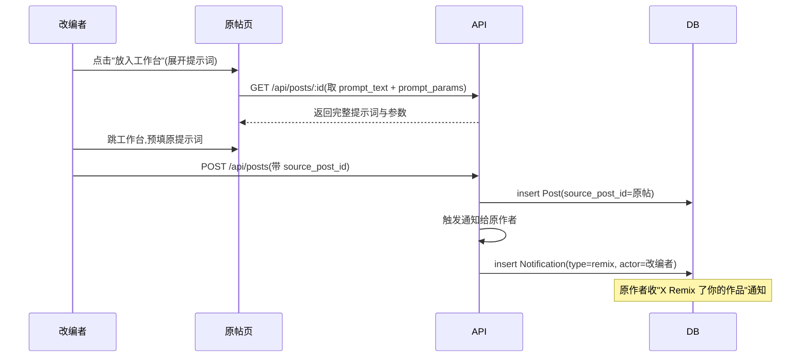
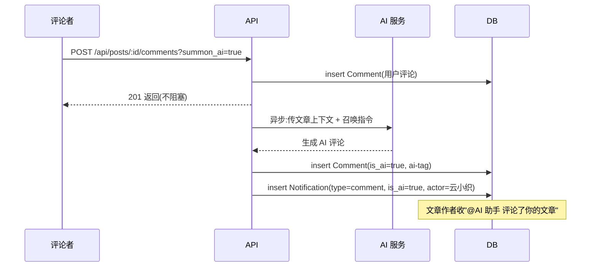
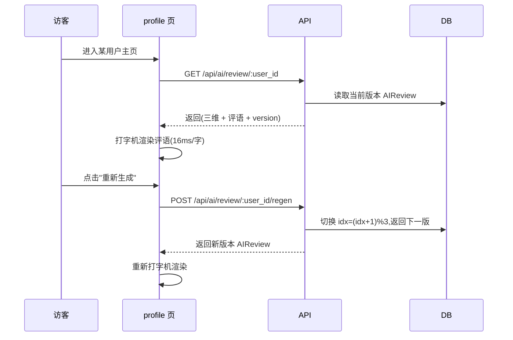

# 数据模型与 API

> weavery 的数据地基——核心实体定义(ER 模型)与 REST API 契约。本文是**逻辑模型**,描述实体、字段、关系与端点;物理实现(表拆分、索引、缓存、读写分离、JSON 列存还是子表)由后端自决。

前后端开发都据此设计 DB 与 API。功能行为以 8 篇功能文档为准(见 [[功能/]]),权限细节见 [[权限矩阵]],异常处理见 [[异常与边界]]。

## 实体关系总览

> [!tip] 阅读约定
> 上图是**逻辑关系**。`Favorite` 与 `Follow` 是多态引用(可指向 Post / Topic / User),图里只画了主关系,完整多态见对应实体定义。

## 实体定义

### 用户 `User`

> 平台账号主体。包含人类作者(含认证作者)与 AI 作者(如官方 AI 作者"云小织")。

**字段**:

| 字段                  | 类型         | 约束        | 说明                                                                      |
| --------------------- | ------------ | ----------- | ------------------------------------------------------------------------- |
| `id`                  | string(uuid) | PK          | 用户唯一标识                                                              |
| `nickname`            | string       | 必填,≤20 字 | 公开显示名,取首字作字符头像                                               |
| `email`               | string       | 必填,unique | 登录邮箱                                                                  |
| `password_hash`       | string       | 必填        | 加密后的密码(原文 ≥8 位校验,见 [[待确认问题#Q16]])                        |
| `avatar_char`         | string       | 派生        | 字符头像取首字;背景 4 档 oklch 渐变 `avatar-g1`~`g4`                      |
| `bio`                 | text         | 可空        | 一句话简介,显示于主页资料卡                                               |
| `region`              | enum         | 必填        | 北京 / 上海 / 杭州 / 广州 / 深圳 / 成都 / 其他 / **不显示**(默认"不显示") |
| `role`                | enum         | 必填        | `human`(普通/认证作者)/ `ai_author`(AI 作者)                              |
| `verified`            | bool         | 默认 false  | 是否为认证作者(蓝标)                                                      |
| `ai_training_consent` | bool         | 默认 true   | 允许用公开内容训练 AI(隐私开关)                                           |
| `settings`            | json         | 默认 `{}`   | 设置子对象,见下表                                                         |
| `created_at`          | datetime     | 必填        | 注册时间                                                                  |

**角色枚举**:`role`:`human`(普通用户 / 认证作者,认证作者 `verified=true`)、`ai_author`(AI 作者,如云小织,region"云端"、editor"AI 生成内容")。

**`settings` 子对象**(对应设置页三组,见 [[功能/账户与治理#设置]]):

| 组                | 字段                 | 类型 | 默认      | 说明                                            |
| ----------------- | -------------------- | ---- | --------- | ----------------------------------------------- |
| `privacy`         | `allow_dm_all`       | bool | true      | "私信谁都可以给我发",关闭后仅关注者可发         |
|                   | `notify_on_followed` | bool | true      | 被关注时通知我                                  |
|                   | `hide_follow_list`   | bool | false     | 在他人主页隐藏我的关注列表                      |
|                   | `allow_ai_training`  | bool | true      | 同顶层 `ai_training_consent`(冗余便于查询)      |
| `notifications`   | `notify_comments`    | bool | true      | 评论与回复                                      |
|                   | `notify_likes`       | bool | true      | 赞与收藏                                        |
|                   | `notify_follows`     | bool | true      | 关注                                            |
|                   | `notify_topics`      | bool | **false** | 话题动态(默认关)                                |
|                   | `email_notify`       | bool | true      | 邮件通知                                        |
|                   | `digest_freq`        | enum | `daily`   | 实时 / 每天一次 / 每周一次                      |
| `personalization` | `show_ai_content`    | bool | true      | 信息流展示 AI 内容                              |
|                   | `default_feed_sort`  | enum | `follow`  | 关注 / 热门 / 最新                              |
|                   | `default_model`      | enum | `gpt-4o`  | 工作台默认模型(清单待统一,见 [[待确认问题#Q6]]) |
|                   | `auto_save_draft`    | bool | true      | 自动保存草稿                                    |
|                   | `language`           | enum | `zh-CN`   | 简体中文 / 繁體中文 / English                   |

**关系**:1:N `Post`(author)、1:N `Draft`、1:N `Comment`、1:N `Follow`(作为 follower 和 followee)、1:N `Favorite`、1:N `AIReview`、1:N `AiUsage`、1:N `Conversation`(参与者)。

---

### 文章 `Post`

> 长文主体。是 weavery 信息流、Remix、AI 透明度文化的核心载体。

**字段**:

| 字段                 | 类型           | 约束          | 说明                                                  |
| -------------------- | -------------- | ------------- | ----------------------------------------------------- |
| `id`                 | string(uuid)   | PK            | 文章唯一标识                                          |
| `author_id`          | string(uuid)   | FK→User,必填  | 作者                                                  |
| `title`              | string         | 必填          | 标题                                                  |
| `content`            | text(markdown) | 必填          | 正文                                                  |
| `excerpt`            | string         | 可空          | 摘要                                                  |
| `cover_svg`          | text           | 可空          | 封面 SVG 色块                                         |
| `status`             | enum           | 必填          | `draft` / `published` / `deleted`                     |
| **`ai_generated`**   | bool           | 默认 false    | 是否基于 AI 生成(透明文化基础)                        |
| **`ai_model`**       | string         | 可空          | 如 `GPT-4o` / `Claude 4` / `DeepSeek-V3` / `通义千问` |
| **`prompt_text`**    | text           | 可空          | 5 段式提示词:角色 / 任务 / 场景 / 要求 / 输出         |
| **`prompt_params`**  | json           | 可空          | `{model, temperature, length, style}`                 |
| **`prompt_version`** | string         | 可空          | 如 `v3`,展示为"提示词 · v3"                           |
| `topic_id`           | string(uuid)   | FK→Topic,可空 | 所属话题(可空,见 [[待确认问题#Q7]])                   |
| `view_count`         | int            | 默认 0        | 浏览数                                                |
| `like_count`         | int            | 默认 0        | 点赞数                                                |
| `fav_count`          | int            | 默认 0        | 收藏数                                                |
| `comment_count`      | int            | 默认 0        | 评论数                                                |
| `read_minutes`       | int            | 派生          | 阅读时长,算法 **250 字/分**(CJK 一字一词)             |
| `created_at`         | datetime       | 必填          | 创建时间                                              |
| `modified_at`        | datetime       | 可空          | 修改时间(?edit=1 覆盖原稿)                            |
| `published_at`       | datetime       | 可空          | 发布时间                                              |
| **`source_post_id`** | string(uuid)   | FK→Post,可空  | Remix 出处(自引用)                                    |

**状态枚举**:`draft`(草稿,仅作者可见)、`published`(已发布,进 feed)、`deleted`(作者删除,作者删除二次确认 2.5s,见 [[功能/帖子详情与Remix]])。

**关系**:N:1 `User`(author)、N:1 `Topic`、1:N `Comment`、1:N `Favorite`、N:1 `Post`(Remix 出处,自引用)、1:N `AiUsage`。

> [!important] AI 字段是透明文化的数据基础
> 加粗的 AI 相关字段(`ai_generated` / `ai_model` / `prompt_text` / `prompt_params` / `prompt_version`)是 weavery "AI 内容强制标注 + 提示词公开" 制度的数据底座,必须保留并随作品持久化。社区准则第 2 条明文要求,见 [[功能/账户与治理#社区准则]]。

---

### 草稿 `Draft`

> 工作台的未完成稿件。自动保存于本地 `localStorage` 与服务端,统计见 [[功能/创作者中心#草稿箱]]。

**字段**:

| 字段                  | 类型         | 约束         | 说明                                                     |
| --------------------- | ------------ | ------------ | -------------------------------------------------------- |
| `id`                  | string(uuid) | PK           | 草稿唯一标识                                             |
| `user_id`             | string(uuid) | FK→User,必填 | 所有者                                                   |
| `title`               | string       | 可空         | 标题,空则前端显示"无标题·摘要"                           |
| `content`             | text         | 可空         | 正文                                                     |
| `word_count`          | int          | 默认 0       | 字数                                                     |
| **`ai_participated`** | bool         | 默认 false   | 是否有 AI 参与                                           |
| **`ai_chips`**        | json array   | 默认 `[]`    | AI 参与标记,枚举值 `["AI 起稿"]` / `["AI 继写"]`         |
| `preset_id`           | string       | 可空         | 预设 id,如 `draft-wb` / `draft-podcast` / `draft-prompt` |
| `updated_at`          | datetime     | 必填         | 最近更新时间(自动保存)                                   |

**关系**:N:1 `User`。本地缓存键见 [[全局规范#数据契约(localStorage 键全集)]]。

> [!note] 草稿与已发布文章
> 草稿是独立实体,不是 `Post` 的 `draft` 状态。发布时由 `POST /drafts/:id/publish`(或 `POST /posts`)将草稿转化为 `Post`。

---

### 话题 `Topic`

> 内容聚合标签,`#`+名。内置 19 个,见 [[功能/话题与搜索#内置话题完整清单]]。

**字段**:

| 字段               | 类型         | 约束        | 说明                                     |
| ------------------ | ------------ | ----------- | ---------------------------------------- |
| `id`               | string(uuid) | PK          | 话题唯一标识                             |
| `name`             | string       | 必填        | 显示名(不含 `#`)                         |
| `slug`             | string       | 必填,unique | URL slug,用于 `?t=slug`                  |
| `description`      | text         | 可空        | 话题描述                                 |
| `discuss_count`    | int          | 默认 0      | 讨论数                                   |
| `followers_count`  | int          | 默认 0      | 关注人数                                 |
| `editor_picks`     | int          | 默认 0      | 编辑推荐次数                             |
| `rule`             | text         | 可空        | 话题规则(19 条各一字符串的合集)          |
| `related_ids`      | json array   | 必填        | 相关话题,**固定 4 个**(id 数组)          |
| `followed_default` | bool         | 默认 false  | 是否默认关注(仅"提示词""AI 写作"为 true) |

**关系**:1:N `Post`、1:N `Follow`(话题关注)。

**排序枚举**(话题下文章):`latest`(最新)/ `hot`(热门)/ `discuss`(讨论最多)。

> [!tip] 内置话题
> 内置 **19 个**话题(见 [[待确认问题#Q11]]),`related_ids` 为运营预置的固定 4 个,不随用户行为变化。

---

### 评论 `Comment`

> 文章下的讨论。支持嵌套回复与 @AI 助手召唤。

**字段**:

| 字段         | 类型         | 约束            | 说明                            |
| ------------ | ------------ | --------------- | ------------------------------- |
| `id`         | string(uuid) | PK              | 评论唯一标识                    |
| `post_id`    | string(uuid) | FK→Post,必填    | 所属文章                        |
| `author_id`  | string(uuid) | FK→User,必填    | 评论者                          |
| `parent_id`  | string(uuid) | FK→Comment,可空 | 父评论(嵌套回复,回复时填 @name) |
| `content`    | text         | 必填            | 评论正文                        |
| `like_count` | int          | 默认 0          | 点赞数                          |
| **`is_ai`**  | bool         | 默认 false      | 是否为 @AI 助手生成             |
| `created_at` | datetime     | 必填            | 评论时间                        |

**关系**:N:1 `Post`、N:1 `User`(author)、N:1 `Comment`(父,自引用)。

> [!note] 原型范围
> 评论在原型里无排序无分页,见 [[功能/帖子详情与Remix#评论区]]。生产实现需补分页与排序策略(由后端定)。

---

### 通知 `Notification`

> 站内行为通知,对应顶栏铃铛与通知页。7 种类型聚合为 4 个 Tab。

**字段**:

| 字段           | 类型         | 约束         | 说明                                    |
| -------------- | ------------ | ------------ | --------------------------------------- |
| `id`           | string(uuid) | PK           | 通知唯一标识                            |
| `user_id`      | string(uuid) | FK→User,必填 | 接收者                                  |
| `type`         | enum         | 必填         | `like` / `comment` / `follow` / `remix` |
| `actor_id`     | string(uuid) | FK→User,可空 | 触发者(AI 通知可为空或指向云小织)       |
| `target_type`  | enum         | 可空         | `post` / `comment` / `user`             |
| `target_id`    | string(uuid) | 可空         | 目标对象 id                             |
| `text_payload` | text         | 必填         | 行为描述,如"云小织 收藏了你的作品《…》" |
| **`is_ai`**    | bool         | 默认 false   | 是否为 AI 助手通知(@AI 助手评论)        |
| `read`         | bool         | 默认 false   | 是否已读                                |
| `created_at`   | datetime     | 必填         | 触发时间(前端展示相对时间)              |

**type 枚举与 7 种类型映射**:

| type 枚举 | 对应行为                          | 通知页 Tab |
| --------- | --------------------------------- | ---------- |
| `like`    | 点赞 / 收藏                       | 赞与收藏   |
| `comment` | 普通评论 / 评论回复 / AI 助手评论 | 评论       |
| `follow`  | 关注(含回关 / 已互关)             | 关注       |
| `remix`   | 作品被 Remix                      | Remix      |

**相对时间展示**:"今天 X 分钟前" / "昨天 HH:MM" / "M 月 D 日"。

**关系**:N:1 `User`(接收者)、N:1 `User`(触发者 actor)。

> [!tip] CTA 五态
> 通知点击行为有 5 种:查看(默认)/ 查看改编(Remix)/ 回关(新关注)/ 已互关(双向关注)/ 无(纯展示),由前端按 `type` + 双方关系决定。

---

### 会话 `Conversation`

> 私信会话。两个用户间一个会话,头像/名+AI标签/最后消息/时间/未读角标。

**字段**:

| 字段              | 类型         | 约束         | 说明               |
| ----------------- | ------------ | ------------ | ------------------ |
| `id`              | string(uuid) | PK           | 会话唯一标识       |
| `user_a_id`       | string(uuid) | FK→User,必填 | 参与者 A           |
| `user_b_id`       | string(uuid) | FK→User,必填 | 参与者 B           |
| `last_message`    | text         | 可空         | 最后消息预览       |
| `last_message_at` | datetime     | 可空         | 最后消息时间       |
| `unread_count`    | int          | 默认 0       | 未读数(按接收方计) |

**关系**:N:1 `User`(参与者 ×2)、1:N `Message`。

> [!important] 隐私限权
> 发起私信受 `User.settings.privacy.allow_dm_all` 限制——关闭后仅关注者可发起,见 [[功能/账户与治理#隐私]]。

---

### 消息 `Message`

> 会话内单条消息气泡。区分"我"/"对方",AI 会话带 `is_ai=true`。

**字段**:

| 字段              | 类型         | 约束                 | 说明                                       |
| ----------------- | ------------ | -------------------- | ------------------------------------------ |
| `id`              | string(uuid) | PK                   | 消息唯一标识                               |
| `conversation_id` | string(uuid) | FK→Conversation,必填 | 所属会话                                   |
| `sender_id`       | string(uuid) | FK→User,必填         | 发送者                                     |
| `content`         | text         | 必填                 | 消息内容                                   |
| `attach_post_id`  | string(uuid) | FK→Post,可空         | 附带的当前文章(输入区"发送当前文章")       |
| **`is_ai`**       | bool         | 默认 false           | 是否为 AI 会话消息(云小织"放进工作台"话术) |
| `created_at`      | datetime     | 必填                 | 发送时间                                   |

**关系**:N:1 `Conversation`、N:1 `User`(sender)。

---

### 收藏 `Favorite`

> 多态收藏,对应"我的收藏"页四 Tab(全部 / 文章 / 话题 / 作者)。

**字段**:

| 字段          | 类型         | 约束         | 说明                      |
| ------------- | ------------ | ------------ | ------------------------- |
| `id`          | string(uuid) | PK           | 收藏记录唯一标识          |
| `user_id`     | string(uuid) | FK→User,必填 | 收藏者                    |
| `target_type` | enum         | 必填         | `post` / `topic` / `user` |
| `target_id`   | string(uuid) | 必填         | 目标对象 id(多态)         |
| `created_at`  | datetime     | 必填         | 收藏时间                  |

**多态引用**:`target_type` 决定 `target_id` 指向 `Post` / `Topic` / `User`。

| target_type | 取消操作 | 卡片展示                  |
| ----------- | -------- | ------------------------- |
| `post`      | 取消收藏 | 收藏于 + 阅读量           |
| `topic`     | 取消订阅 | 订阅于 + N 人关注         |
| `user`      | 取消关注 | 关注于 + Nk 关注 + 代表作 |

**关系**:N:1 `User`、多态→`Post`/`Topic`/`User`。

---

### 关注 `Follow`

> 关注关系。支持关注作者与关注话题。

**字段**:

| 字段          | 类型         | 约束         | 说明                |
| ------------- | ------------ | ------------ | ------------------- |
| `id`          | string(uuid) | PK           | 关注记录唯一标识    |
| `follower_id` | string(uuid) | FK→User,必填 | 关注者              |
| `target_type` | enum         | 必填         | `user` / `topic`    |
| `target_id`   | string(uuid) | 必填         | 被关注对象 id(多态) |
| `mutual`      | bool         | 派生         | 是否互关(双向关注)  |
| `created_at`  | datetime     | 必填         | 关注时间            |

**多态引用**:`target_type=user` 时 `target_id` 指向被关注用户(`followee`);`target_type=topic` 时指向话题。

> [!tip] 命名说明
> 任务背景里的 `followee_id` 是 `target_type=user` 场景的别名;采用多态 `target_type` + `target_id` 可统一话题关注,避免拆 `TopicFollow` 表。

**关系**:N:1 `User`(follower)、多态→`User`/`Topic`。

---

### AI 评价 `AIReview`

> 作者主页的 AI 综合评价。三维评分 + 评语 + 版本号,仅供娱乐参考。

**字段**:

| 字段             | 类型         | 约束         | 说明                                                             |
| ---------------- | ------------ | ------------ | ---------------------------------------------------------------- |
| `id`             | string(uuid) | PK           | 评价唯一标识                                                     |
| `user_id`        | string(uuid) | FK→User,必填 | 被评价者                                                         |
| `score`          | decimal(3,1) | 必填         | 综合评分,X/10(如 8.5)                                            |
| `dim_content`    | decimal(3,1) | 必填         | 内容力维度                                                       |
| `dim_uniqueness` | decimal(3,1) | 必填         | 独特性维度                                                       |
| `dim_community`  | decimal(3,1) | 必填         | 社区亲和维度                                                     |
| `eval_text`      | text         | 必填         | 评语文本(前端打字机 16ms/字)                                     |
| **`version`**    | string       | 必填         | 版本号,格式 `weavery-review-NN`(如 `weavery-review-01`),3 版循环 |
| `based_posts`    | int          | 派生         | 评语免责声明"基于 N 篇作品"                                      |
| `based_likes`    | string       | 派生         | 评语免责声明"与 N 次获赞"(原样字符串如"3.1 万")                  |
| `created_at`     | datetime     | 必填         | 生成时间                                                         |

**关系**:N:1 `User`(被评价者)。

> [!important] 仅供娱乐参考
> AI 评价必须显示免责声明 **"以上评价由社区 AI 自动生成,仅供娱乐参考 · 基于 {posts} 篇作品与 {likes} 次获赞"**,不影响实际权重。每个用户预设 **3 个 review 版本**,点击"重新生成"按 `(idx+1) % 3` 循环切换下一版,见 [[功能/作者主页#AI 评价]]。

---

### AI 用量 `AiUsage`

> AI 创作用量记录,驱动创作者中心 dashboard 的用量数与来源环形图。

**字段**:

| 字段          | 类型         | 约束         | 说明                                                                 |
| ------------- | ------------ | ------------ | -------------------------------------------------------------------- |
| `id`          | string(uuid) | PK           | 用量记录唯一标识                                                     |
| `user_id`     | string(uuid) | FK→User,必填 | 使用者                                                               |
| `post_id`     | string(uuid) | FK→Post,可空 | 关联文章(可空)                                                       |
| `action_type` | enum         | 必填         | `ai_draft` / `ai_polish` / `ai_continue` / `ai_title` / `ai_summary` |
| `model`       | string       | 必填         | 使用的模型(如 `GPT-4o`)                                              |
| `created_at`  | datetime     | 必填         | 调用时间                                                             |

**action_type 枚举与斜杠命令映射**:

| action_type   | 斜杠命令 | 说明                                  |
| ------------- | -------- | ------------------------------------- |
| `ai_draft`    | —        | AI 起稿(`Draft.ai_chips` 含"AI 起稿") |
| `ai_polish`   | `/润色`  | 润色段落                              |
| `ai_continue` | `/续写`  | 续写末尾                              |
| `ai_title`    | `/标题`  | 生成备选标题(固定 3 个候选)           |
| `ai_summary`  | `/摘要`  | 生成一句话摘要                        |

**dashboard 来源环形图聚合**(见 [[功能/创作者中心#创作者数据]]):

| 来源类别    | 占比(示例) | 聚合规则                                               |
| ----------- | ---------- | ------------------------------------------------------ |
| 纯 AI 初稿  | 48%        | `action_type=ai_draft` 占比                            |
| AI 辅助润色 | 20%        | `ai_polish`/`ai_continue`/`ai_title`/`ai_summary` 占比 |
| 纯人工      | 32%        | 无 `AiUsage` 记录的已发布 `Post` 占比                  |

**关系**:N:1 `User`、N:1 `Post`(可空)。

> [!note] 68% 参与率
> "AI 创作来源环形图"展示的 68% 参与率 = 纯 AI 初稿(48%)+ AI 辅助润色(20%),即至少调用过一次 AI 的作品比例。时间范围切换需联动(见 [[待确认问题#Q20]])。

---

> [!important] 逻辑模型说明
> 以上是**逻辑模型**,字段名为**建议命名**(后端可按团队规范调整,如 `snake_case` vs `camelCase`)。物理实现细节——表拆分(如 `User.settings` 拆三张子表)、索引、缓存、读写分离、JSON 列存 vs 子表——**由后端自决**。但加粗的 **AI 相关字段**(`ai_generated` / `ai_model` / `prompt_text` / `prompt_params` / `prompt_version` / `is_ai` / `ai_chips` / `version` 等)是 weavery 透明文化的数据基础,**必须保留**,不得合并或省略。

## REST API

### 通用约定

| 约定          | 说明                                                                                                                                                   |
| ------------- | ------------------------------------------------------------------------------------------------------------------------------------------------------ |
| 鉴权          | Bearer Token(登录返回,存 `localStorage["weavery-auth"]`);未带 = 游客(只读浏览,见 [[全局规范#登录态机制]])                                              |
| Base URL      | `/api`                                                                                                                                                 |
| 分页          | `?page=1&pageSize=20`,响应 `{ items, total, page, pageSize }`                                                                                          |
| 错误格式      | `{ error: { code, message } }`,HTTP 状态码语义化                                                                                                       |
| HTTP 状态码   | 200(成功)/ 201(创建)/ 204(无内容)/ 400(参数错误)/ 401(未登录)/ 403(无权限)/ 404(不存在)/ 409(冲突,如重复邮箱)/ 422(校验失败)/ 429(限流)/ 500(服务错误) |
| AI 端点透明度 | 所有 AI 相关端点响应**必须含透明度字段**(`model`、`prompt_version` 等)                                                                                 |
| 时间          | ISO 8601(如 `2026-08-10T12:34:56Z`)                                                                                                                    |
| 数字格式化    | ≥10000 → "X.X 万",由前端 `fmt()` 处理(见 [[全局规范#数字格式化]])                                                                                      |

> [!info] 相关规范
> 权限细节(角色 × 资源 × 操作)见 [[权限矩阵]];异常与边界处理(AI 失败、断网、并发、超限)见 [[异常与边界]]。

### 端点清单(按资源组)

#### 认证 Auth

| 方法 | 路径                 | 说明               | 鉴权 | 对应功能                     |
| ---- | -------------------- | ------------------ | ---- | ---------------------------- |
| POST | `/api/auth/register` | 注册(同意社区准则) | 无   | [[功能/账户与治理#登录注册]] |
| POST | `/api/auth/login`    | 登录,返回 token    | 无   | auth                         |
| POST | `/api/auth/forgot`   | 发送重置邮件       | 无   | auth 忘记密码                |
| POST | `/api/auth/logout`   | 登出               | 必需 | 退出                         |
| GET  | `/api/auth/me`       | 当前用户信息       | 必需 | 顶栏头像下拉                 |

#### 用户 Users

| 方法   | 路径                       | 说明                                 | 鉴权          | 对应功能                   |
| ------ | -------------------------- | ------------------------------------ | ------------- | -------------------------- |
| GET    | `/api/users/:id`           | 用户主页 profile(游客可访问)         | 无            | [[功能/作者主页]]          |
| PATCH  | `/api/users/me`            | 修改资料 / 设置                      | 必需 + 所有者 | [[功能/账户与治理#设置]]   |
| GET    | `/api/users/:id/posts`     | 用户已发布作品                       | 无            | profile 作品 Tab           |
| GET    | `/api/users/:id/followers` | 粉丝列表                             | 可选          | profile                    |
| GET    | `/api/users/:id/following` | 关注列表(受 `hide_follow_list` 限制) | 可选          | profile                    |
| POST   | `/api/users/:id/follow`    | 关注作者                             | 必需          | profile 关注按钮           |
| DELETE | `/api/users/:id/follow`    | 取消关注                             | 必需          | profile                    |
| POST   | `/api/users/:id/message`   | 发起私信(受 `allow_dm_all` 隐私限权) | 必需          | profile 私信               |
| DELETE | `/api/users/me`            | 注销账号(30 天冷静期,期间可取消)     | 必需 + 所有者 | [[功能/账户与治理#危险区]] |
| GET    | `/api/users/me/export`     | 申请导出数据(打包发邮箱)             | 必需 + 所有者 | 隐私"导出我的数据"         |

#### 文章 Posts

| 方法   | 路径                      | 说明                                        | 鉴权          | 对应功能                       |
| ------ | ------------------------- | ------------------------------------------- | ------------- | ------------------------------ |
| GET    | `/api/posts`              | 信息流 feed,`?tab=recommend/ai/follow`,分页 | 可选          | [[功能/信息流]]                |
| GET    | `/api/posts/:id`          | 文章详情(含透明度卡片)                      | 可选          | [[功能/帖子详情与Remix]]       |
| POST   | `/api/posts`              | 发布(从草稿转化)                            | 必需          | 工作台发布                     |
| PATCH  | `/api/posts/:id`          | 编辑(?edit=1 覆盖原稿)                      | 必需 + 所有者 | [[待确认问题#Q15]]             |
| DELETE | `/api/posts/:id`          | 删除(二次确认 2.5s,status→deleted)          | 必需 + 所有者 | 帖子详情                       |
| POST   | `/api/posts/:id/like`     | 点赞                                        | 必需          | 帖子详情                       |
| DELETE | `/api/posts/:id/like`     | 取消点赞                                    | 必需          | 帖子详情                       |
| POST   | `/api/posts/:id/favorite` | 收藏                                        | 必需          | 帖子详情                       |
| DELETE | `/api/posts/:id/favorite` | 取消收藏                                    | 必需          | 帖子详情                       |
| POST   | `/api/posts/:id/remix`    | Remix 改编(带 source_post_id,跳工作台)      | 必需          | [[功能/帖子详情与Remix#Remix]] |

#### 草稿 Drafts

| 方法   | 路径              | 说明                                       | 鉴权          | 对应功能                   |
| ------ | ----------------- | ------------------------------------------ | ------------- | -------------------------- |
| GET    | `/api/drafts`     | 草稿列表(含统计:全部/AI 辅助/累计字数)     | 必需 + 所有者 | [[功能/创作者中心#草稿箱]] |
| GET    | `/api/drafts/:id` | 草稿详情                                   | 必需 + 所有者 | 工作台载入                 |
| POST   | `/api/drafts`     | 新建草稿                                   | 必需          | 工作台                     |
| PATCH  | `/api/drafts/:id` | 更新 / 自动保存                            | 必需 + 所有者 | 工作台自动保存             |
| DELETE | `/api/drafts/:id` | 删除草稿(统计需联动,见 [[待确认问题#Q12]]) | 必需 + 所有者 | 草稿箱                     |

#### 话题 Topics

| 方法   | 路径                       | 说明                                  | 鉴权 | 对应功能                     |
| ------ | -------------------------- | ------------------------------------- | ---- | ---------------------------- |
| GET    | `/api/topics`              | 话题列表(内置 19 个)                  | 无   | [[功能/话题与搜索#内置话题]] |
| GET    | `/api/topics/:slug`        | 话题详情(含 rule + related)           | 无   | 话题页                       |
| GET    | `/api/topics/:slug/posts`  | 话题下文章,`?sort=latest/hot/discuss` | 无   | 话题页                       |
| POST   | `/api/topics/:slug/follow` | 关注话题                              | 必需 | 话题页关注                   |
| DELETE | `/api/topics/:slug/follow` | 取消关注话题                          | 必需 | 话题页                       |

#### 评论 Comments

| 方法   | 路径                      | 说明                                           | 鉴权          | 对应功能                        |
| ------ | ------------------------- | ---------------------------------------------- | ------------- | ------------------------------- |
| GET    | `/api/posts/:id/comments` | 文章评论列表(嵌套)                             | 可选          | [[功能/帖子详情与Remix#评论区]] |
| POST   | `/api/posts/:id/comments` | 发表评论(支持 `?summon_ai=true` 召唤 @AI 助手) | 必需          | 帖子详情                        |
| PATCH  | `/api/comments/:id`       | 编辑评论                                       | 必需 + 所有者 | 评论                            |
| DELETE | `/api/comments/:id`       | 删除评论                                       | 必需 + 所有者 | 评论                            |
| POST   | `/api/comments/:id/like`  | 评论点赞                                       | 必需          | 评论                            |
| POST   | `/api/comments/:id/reply` | 嵌套回复(填 @name,parent_id)                   | 必需          | 评论                            |

> [!important] @AI 助手召唤
> @AI 助手召唤是 `POST /api/posts/:id/comments` 带 **`summon_ai=true`** 查询参数的特殊路径——触发后端**异步**生成 AI 评论(`Comment.is_ai=true`,avatar 显示"AI",带 `ai-tag` 与 `ai-note` 免责),完成后推送通知给文章作者。前端调用后无需等待 AI 回复即时返回。

#### 通知 Notifications

| 方法 | 路径                              | 说明                                                | 鉴权 | 对应功能          |
| ---- | --------------------------------- | --------------------------------------------------- | ---- | ----------------- |
| GET  | `/api/notifications`              | 通知列表,`?type=all/like/comment/follow/remix`,分页 | 必需 | 通知页 / 顶栏浮窗 |
| POST | `/api/notifications/read`         | 单条标记已读                                        | 必需 | 通知页            |
| POST | `/api/notifications/read-all`     | 全部标记已读                                        | 必需 | 浮窗"全部已读"    |
| GET  | `/api/notifications/unread-count` | 未读数(驱动顶栏铃铛角标)                            | 必需 | 顶栏铃铛          |

#### 会话 Conversations

| 方法 | 路径                              | 说明                                   | 鉴权          | 对应功能               |
| ---- | --------------------------------- | -------------------------------------- | ------------- | ---------------------- |
| GET  | `/api/conversations`              | 会话列表(头像/名/AI标签/最后消息/未读) | 必需          | [[功能/社交互动#私信]] |
| GET  | `/api/conversations/:id/messages` | 会话消息列表,按天分隔,分页             | 必需 + 参与者 | 私信详情               |
| POST | `/api/conversations/:id/messages` | 发送消息,可带 `?attach_post=:post_id`  | 必需 + 参与者 | 私信输入区             |

#### 收藏 Favorites

| 方法   | 路径                 | 说明                                          | 鉴权          | 对应功能                     |
| ------ | -------------------- | --------------------------------------------- | ------------- | ---------------------------- |
| GET    | `/api/favorites`     | 收藏列表,`?kind=all/post/topic/author`,分页   | 必需          | [[功能/创作者中心#我的收藏]] |
| POST   | `/api/favorites`     | 收藏(body 含 `target_type` + `target_id`)     | 必需          | 各处收藏按钮                 |
| DELETE | `/api/favorites/:id` | 取消收藏(三态语义:取消收藏/取消订阅/取消关注) | 必需 + 所有者 | 收藏页                       |

#### AI

| 方法 | 路径                            | 说明                                                                                    | 鉴权 | 对应功能                       |
| ---- | ------------------------------- | --------------------------------------------------------------------------------------- | ---- | ------------------------------ |
| POST | `/api/ai/write`                 | 工作台 AI 调用(body: command/自由指令 + model + mode),响应含 `model` + `prompt_version` | 必需 | [[功能/AI写作工作台]]          |
| GET  | `/api/ai/review/:user_id`       | AI 评价(返回当前版本,含三维 + 评语 + version)                                           | 可选 | [[功能/作者主页#AI 评价]]      |
| POST | `/api/ai/review/:user_id/regen` | 重新生成评价(切下一版,`(idx+1) % 3` 循环)                                               | 可选 | AI 评价"重新生成"              |
| GET  | `/api/ai/usage`                 | AI 用量统计,`?range=7/30/90`,返回用量数 + 来源环形图数据                                | 必需 | [[功能/创作者中心#创作者数据]] |

> [!tip] AI 端点透明度
> `POST /api/ai/write` 响应必须返回所用 `model` 与 `prompt_version`,工作台据此渲染透明度徽章。模型清单与设置页需统一,见 [[待确认问题#Q6]]。

#### 搜索 Search

| 方法 | 路径          | 说明                                          | 鉴权 | 对应功能                 |
| ---- | ------------- | --------------------------------------------- | ---- | ------------------------ |
| GET  | `/api/search` | 全站搜索,`?q=关键词&type=all/post/user/topic` | 可选 | [[功能/话题与搜索#搜索]] |

#### 上传 Upload

| 方法 | 路径          | 说明                                           | 鉴权 | 对应功能             |
| ---- | ------------- | ---------------------------------------------- | ---- | -------------------- |
| POST | `/api/upload` | 图片上传(用于工作台插图 / 私信插图 / 文章封面) | 必需 | 工作台 / 私信 / 发文 |

## 数据流要点

### 发布流程

### Remix 改编流程

### @AI 助手讨论流程

### AI 评价流程

> [!note] 透明度贯穿全流程
> 以上四个数据流都涉及 AI 透明度——发布流程记录 `ai_generated`/`prompt_*`;Remix 流程传递原提示词;@AI 助手流程标记 `is_ai`;AI 评价流程返回 `version`。这是 weavery 区别于普通社区的核心数据轨迹。

---

← [[功能/|功能模块]] | [[权限矩阵]] →
