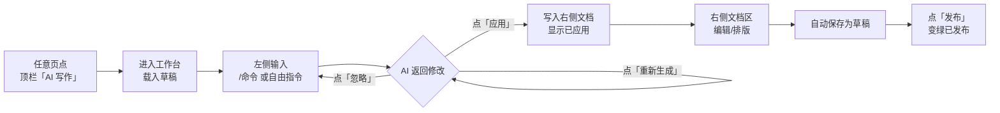
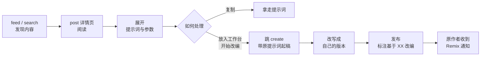
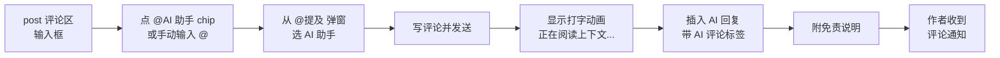

# 用户流程

本文梳理 3 条核心流程。更多边缘流程(注册、设置、私信等)较为直观,不单独成文。

## 流程一:AI 写作并发布(主流程)

> 从零到一,用 AI 写完一篇文章并发布。

**关键节点**:
1. **进入**:任意页点顶栏「AI 写作」→ `create`
2. **指令**:左侧对话面板输入 `/润色` `/续写` `/标题` `/摘要` 或自由指令
3. **决策**:对每条 AI 产出选择 忽略 / 重新生成 / **应用**
4. **成文**:右侧文档区编辑标题/正文,工具栏排版,实时字数与阅读时长
5. **保存**:内容自动存入草稿
6. **发布**:底部「发布」→ 变绿"已发布",Toast 提示成功

## 流程二:发现 → 阅读 → Remix 改编

> 看到一篇好作品(尤其是 AI 生成、提示词公开的),基于它再创作。

**Remix 机制要点**:
- 入口在 `post` 文章底部和侧栏的"放入工作台 / 开始改编"
- 跳到 `create` 时带上原作品的提示词
- 发布时可标注"基于 XX 的作品改编"
- 原作者会收到 **Remix 通知**(通知中心的 Remix 分类)
- profile 页显示"被 Remix"次数

## 流程三:评论中 @AI 助手 召唤 AI 讨论

> 在评论区让 AI 参与讨论,自动阅读上下文回复。

**要点**:
- `@AI 助手` 是评论区独有能力,触发后 AI 读上下文自动生成回复
- AI 回复带"AI 评论"标签,附免责说明("AI 助手基于公开评论自动生成,可能会看错上下文")
- 该回复同时作为"评论"通知推送给作者(带 AI 标签)

---

← [[信息架构]] | [[术语表]] →
