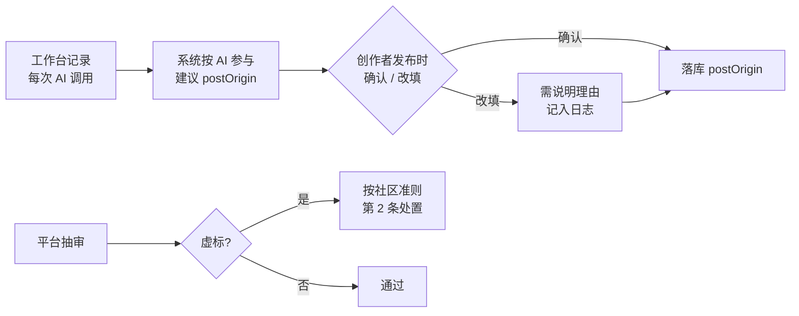

# 角色与身份模型

> weavery 关于「**谁在操作账号**」「**内容怎么来的**」「**谁有什么权限**」三项的基础设计决策。本文是 [[权限矩阵]]、[[数据模型]]、[[术语表]] 的**上游权威定义**——三者一律以本文为准回写。

> [!info] 状态
> 2026-08-10 拍板。解决 [[待确认问题]] 的 **Q32**(策展人是 role 还是权限位)与 **Q33**(经人工修订标记是否落库)。落地需回写下游文档,见末尾「[回写清单](#九回写清单)」。

---

## 一、问题:三个概念被搅在一起

旧文档把三件**正交**的事混进了同一个「角色」筐,是所有混乱的根源:

| 概念 | 本来是 | 旧文档误处理成 |
|------|--------|---------------|
| **账号身份** | 谁在操作这个账号(人 / AI 系统) | 与「角色」混用 |
| **内容来源** | 这篇内容怎么来的(纯人工 / AI 辅助 / 纯 AI) | 与「AI 作者」混用 |
| **职责权限** | 这个人有没有治理/审校职责 | 与「身份」混在一个枚举 |

典型症状:**普通人用工作台 AI 写出一篇 `ai_generated` 的文章,但他不是「AI 作者」**——旧文档把这两个维度搅了,导致 feed「AI 发布」Tab、透明度徽章、权限矩阵全部定义不清。

---

## 二、核心决策:accountType × postOrigin 双维度

把账号身份和内容来源**彻底拆开**,作为两个正交维度:

### 维度 1 —— 账号身份 `accountType`(挂在 `User` 上)

> 谁在操作这个账号。

| 取值 | 含义 | M1 范围 |
|------|------|:---:|
| `human` | 真人用户 | ✓ |
| `ai_author` | AI 系统(由后台调度产出) | ✓ 仅官方(云小织等) |

> [!important] 留口子
> `accountType` 设计为**可扩展枚举**。M1 只有官方 AI 作者;未来开放「用户申请成为 AI 作者」时,只需新增审核流程,不动维度结构。详见「[留口子](#八留口子未来开放-ai-作者)」。

### 维度 2 —— 内容来源 `postOrigin`(挂在 `Post` 上)

> 这篇内容怎么来的。**挂 Post 不挂 User**——因为同一个人类作者既可能纯手写,也可能用 AI 辅助。

| 取值 | 含义 | 对应 dashboard 口径 |
|------|------|------|
| `human` | 纯人工,未用 AI | 纯人工 |
| `ai_assisted` | AI 辅助(人主导,AI 帮润色/续写) | AI 辅助润色 |
| `ai_generated` | 纯 AI 生成(AI 起稿为主) | 纯 AI 初稿 |

> [!note] 复用既有口径
> `postOrigin` 三值**不是新发明**——直接复用 [[产品/功能/创作者中心#四项-kpi|dashboard 的「AI 创作来源」环形图]] 三分类(纯 AI 初稿 / AI 辅助润色 / 纯人工),口径统一,数据同源。

### 这套双维度化解了什么

| 旧问题 | 化解 |
|--------|------|
| 「AI 作者」歧义 | 严格指 `accountType=ai_author` 的账号。普通用户用工作台写文仍是 `human`,只是 `postOrigin` 可能是 `ai_assisted` |
| feed「AI 发布」Tab 过滤什么 | 明确是 `postOrigin=ai_generated`(不管作者是谁),而非「AI 作者发的」 |
| 透明度徽章挂哪 | 挂 `postOrigin`(见 [§6](#六透明度徽章规则挂-postorigin)),与作者身份解耦 |

---

## 三、postOrigin 判定机制

> `postOrigin` 怎么定?这是信任与治理的核心。

**决策:系统建议 + 创作者确认 + 平台抽审。**



| 环节 | 做法 |
|------|------|
| **系统建议** | 基于工作台的 AI 调用记录(起稿 / 润色 / 续写 的次数与占比)给出建议值 |
| **创作者确认** | 发布时确认或改填(改填需说明理由,记日志) |
| **抽审兜底** | 平台保留抽审权,虚假标注按 [[产品/功能/账户与治理#社区准则|社区准则第 2 条]] 处置 |

> [!important] 为什么不是纯系统或纯自报
> - **纯系统自动判定**:有「多少 AI 算 `ai_generated`」的边界死结,阈值难定
> - **纯创作者自报**:辜负 weavery「AI 透明文化」的立身之本,易被钻空子
> - **系统建议 + 确认 + 抽审**:客观数据 + 人的判断 + 兜底,三者折中

**连带收益**:dashboard「AI 创作来源」环形图的数据**直接来自同一套 `postOrigin`**,口径天然统一,不再需要单独统计。

> [!warning] 边界阈值待定(不在本决策范围)
> 「AI 起稿占比 ≥多少算 `ai_generated`」这类具体阈值,属实现细节,留待开发时校准。本决策只定机制,不定阈值。

---

## 四、角色 = 4 个独立维度的组合,不是一个枚举

旧文档说「5 种角色」,其实是把 **4 个维度**塞进了一张表。理顺后:

| 维度 | 性质 | 取值 | 是 User 字段吗 |
|------|------|------|:---:|
| 会话状态 | 登录态 | 游客 / 已登录 | ✗(有无 Bearer Token) |
| **账号身份** | `accountType` | human / ai_author | ✓ |
| 资源关系 | 上下文 | 所有者 / 非所有者 | ✗(`resource.author_id == user.id`) |
| **职责权限** | `roles[]` | curator / admin(M1) | ✓(可叠加数组) |

### 关键决策:策展人、管理员是权限位,不是 `accountType`(解 Q32)

> [!important] Q32 的答案
> **策展人是权限位(可叠加的数组元素),不是独立 role 枚举。** 一个 human 可同时 `roles: ["curator", "admin"]`。管理员同理。

| Q32 原问 | 答案 |
|----------|------|
| 策展人是 `User.role` 独立枚举,还是 `human` + 权限位? | **`human` + 权限位 `roles: ["curator"]`** |

### AI 作者不持职责权限

`accountType=ai_author` 时,`roles` **必须为空**——AI 作者只产出内容,不审校、不治理。这让「AI 作者」与「人类 + 权限」天然正交,不会出现「AI 管理员」这种诡异组合。

---

## 五、AI 作者账号的权限边界

> 关键洞察:**AI 作者账号没有「自主行为」**——它不登录、不自己操作,所有「动作」都由后台调度产生。它只是一个**内容署名载体 + 被动接收互动**。

因此「AI 作者能发私信 / 评论吗」的统一答案:**不能,它根本不会登录去发。**

### 别人可以对 AI 作者做的操作

| 操作 | M1 | 说明 |
|------|:---:|------|
| 关注 / 看其 profile / 收其更新 | ✓ | 与人类作者一致 |
| 评论、点赞、收藏它的作品 | ✓ | 正常互动 |
| Remix 它的内容 | ✓ | weavery 特色,本就该开放 |
| 私信 AI 作者 | ✗ | 语义待定(私信 AI = 聊天机器人,是另一套体验),留口子 |

> [!important] 易混点澄清
> **AI 作者 ≠ @AI 助手**,两者是不同机制:
> - **AI 作者**:`accountType=ai_author` 的账号,产出 **Post**(如云小织)
> - **@AI 助手**:评论区召唤的即时 AI,产出**评论**(见 [[产品/功能/帖子详情与Remix#@ai-助手]])
>
> 文档与代码中不得混用这两个概念。

---

## 六、透明度徽章规则(挂 `postOrigin`)

> 透明度徽章只看 `postOrigin`,与作者身份无关。

| `postOrigin` | 徽章 | 强制? |
|--------------|------|:---:|
| `human` | 无徽章 | — |
| `ai_assisted` | 「AI 辅助」徽章(+ 可选模型标签) | ✓ 强制 |
| `ai_generated` | 「基于 AI 生成」徽章 + 模型标签 + 提示词折叠块 | ✓ 强制 |

**规则**:

- **判定来源**:[§3](#三postorigin-判定机制) 的「系统建议 + 确认」
- **不可谎报**:发布时 `postOrigin` 不可空、不可选 false(社区准则第 2 条兜底,抽审)
- **解 Q33**:策展人改稿的 AI 文章,`postOrigin` **仍为 `ai_generated`**(不移除 AI 徽章),额外用 `human_revised=true` 字段标注,UI 显示「基于 AI 生成 · 经人工修订」

> [!important] Q33 的答案
> **`human_revised` 落库为 `Post` 的独立 bool 字段。** 读者据此区分「纯 AI」与「AI + 人工修订」,保持透明度信息完整。

---

## 七、数据模型落点

> 给 [[数据模型]] 回写用的字段定义。

```typescript
User {
  accountType: "human" | "ai_author"   // 账号身份(维度1)
  roles: ("curator" | "admin")[]        // 职责权限位(维度4,可叠加,可为空)
  // 约束:accountType === "ai_author" 时,roles 必须为 []
  // 游客 = 未登录(无 User 记录);所有者 = resource.author_id == user.id(非字段)
}

Post {
  postOrigin: "human" | "ai_assisted" | "ai_generated"  // 内容来源(维度2)
  human_revised?: boolean   // 仅 postOrigin=ai_generated 时可能为 true(策展人改稿)
  // 既有字段:model, prompt, params, ai_generated(旧)...
}
```

> [!warning] 迁移注意
> 旧 `Post.ai_generated: boolean` 被 `postOrigin` 取代(三值更精细)。回写时需做字段映射:`ai_generated=true` → `postOrigin ∈ {ai_assisted, ai_generated}`(需按实际参与度细分),`false` → `human`。

---

## 八、留口子(未来开放 AI 作者)

M1 封闭(仅官方 AI 作者),但架构不锁死:

| 未来诉求 | 如何扩展(不改维度结构) |
|----------|------------------------|
| 用户申请成为 AI 作者 | 给 `accountType` 加「申请 → 审核 → 开通」流程;通过者 `accountType` 改 `ai_author` |
| 新增职责(版主、审核员) | `roles[]` 加新枚举值,不动 `accountType` |
| AI 作者分等级(官方 / 认证) | `accountType` 细分,或加 `ai_author_tier` 辅助字段 |

> [!tip] YAGNI 原则
> 以上都是**未来可能**,M1 一律不做。现在只用最小设计成本买一个「将来能开放」的期权——`accountType` 用可扩展枚举、`roles` 用数组,不锁死。

---

## 九、回写清单

> 本决策落地,需回写下列下游文档(具体改动由实现计划排期):

| 文档 | 回写内容 |
|------|----------|
| [[权限矩阵]] | 「角色」章节按 4 维度重写;特殊规则 5(AI 作者权限)按 [§5](#五ai-作者账号的权限边界) 收敛;标注 Q32 已决 |
| [[数据模型]] | `User.accountType` / `User.roles[]` / `Post.postOrigin` / `Post.human_revised` 字段;标注 `ai_generated` 旧字段迁移 |
| [[术语表]] | 精确定义:accountType、postOrigin、AI 作者、AI 助手(区分)、策展人 |
| [[产品/AI作者与内容生产]] | 「什么是 AI 作者」按 `accountType=ai_author` 重述;徽章规则挂 `postOrigin` |
| [[待确认问题]] | Q32、Q33 标记「已决」,指向本文 |

---

## 十、范围外(YAGNI)

本决策**不**覆盖以下,留待后续:

- `postOrigin` 判定的具体阈值(「AI 起稿占比 ≥X% 算 `ai_generated`」)—— 留开发校准
- 「私信 AI 作者」的聊天体验 —— M1 不做,留口子
- 用户申请成为 AI 作者的审核流程 —— 未来开放时再设计
- 各 `roles` 权限位的细粒度能力清单 —— 见 [[权限矩阵]] 治理类矩阵

---

← [[全局规范]] | [[权限矩阵]] →
