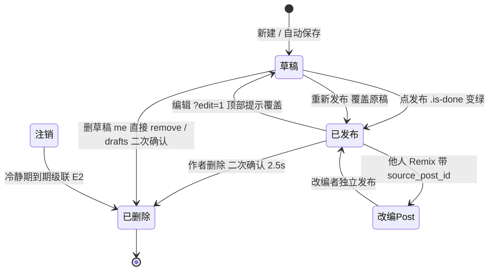
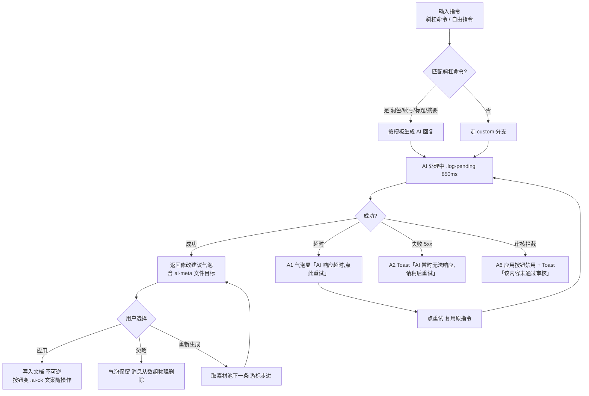
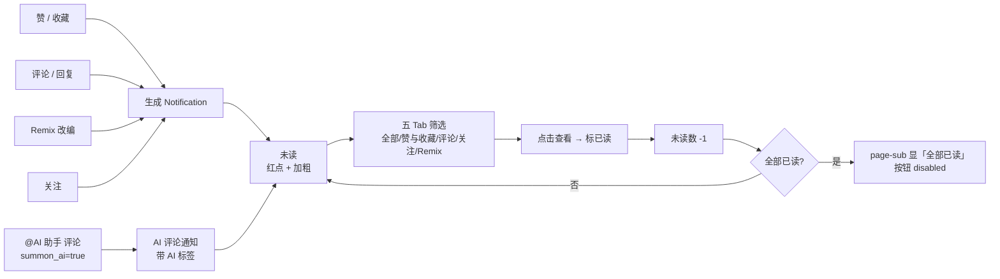
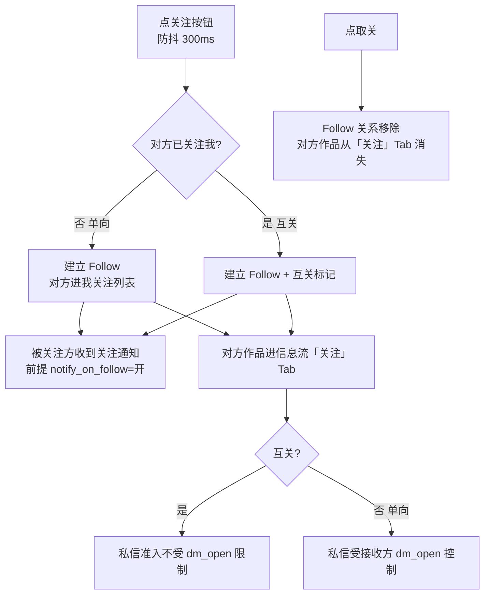
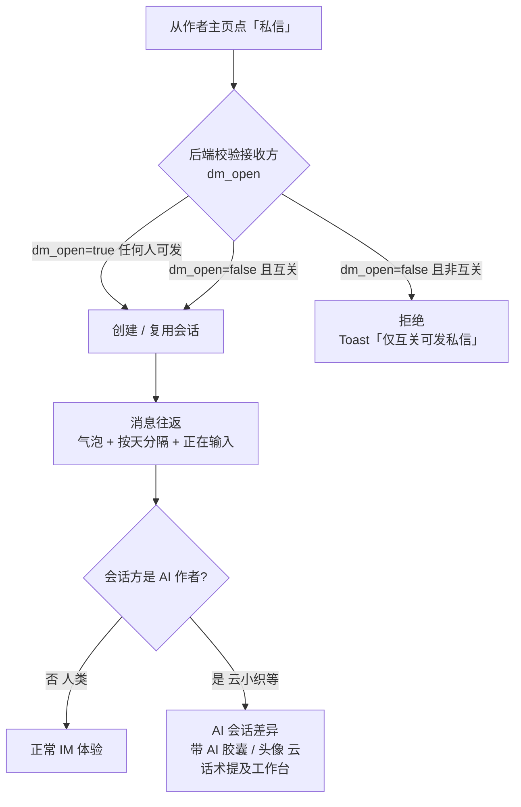

# 验收标准与流转图

> QA 可直接据此写测试用例的可测试 checklist + 跨页生命周期流转图。

本文是 weavery 产品规格的收尾章节,把前面散落在功能文档里的"动作 → 预期"收拢为可执行的验收清单,并补充跨页面的业务生命周期流转图。依赖前三块基石:[[数据模型]](实体与字段)、[[权限矩阵]](角色 × 资源 × 操作)、[[异常与边界]](正常路径之外的处理)。本文分三部分:**核心业务流转图(全局视角)**、**分模块验收 Checklist(逐页可测)**、**全局验收项(跨功能通用)**。

> [!tip] 如何使用
>
> - 测试用例从「第二部分」逐条 checklist 转写,每条已给"动作 → 预期"
> - 涉及多页联动(发布、Remix、关注、注销)时,先看「第一部分」流转图理清链路
> - 跨页通用行为(Toast 时长、断点、空状态)按「第三部分」统一验证
> - 引用锚点精确到具体章节,点击直达规格原文

---

## 第一部分:核心业务流转图

### 1. 文章生命周期

覆盖草稿 → 发布 → 编辑 → 删除 → 注销级联的完整状态流转,含 Remix 分支。状态字段对应 [[数据模型#文章 Post]] 的 `Post.status`(`draft` / `published` / `deleted`)。

> [!info] 关键约束
>
> - 编辑模式"保存即覆盖",无版本树(见 [[功能/AI写作工作台#编辑模式(改已发布文章)]])
> - Remix 产生独立新 Post,不阻塞原作者([[异常与边界#C1 两人同时 Remix 同一篇]])
> - 删除是软删除(`status=deleted`),非物理消失

### 2. AI 交互流程

工作台内"指令 → AI 处理 → 用户决策"的完整链路,含失败回退。AI 任何失败都不直接改写文档(见 [[异常与边界#A AI 相关异常]])。

> [!important] 应用是不可逆的
> 点"应用"后三按钮永久替换为 `.ai-ok`,无法撤销(见 [[功能/AI写作工作台#应用后状态]])。素材池游标持久化到 `localStorage["zd-wb-step"]`。

### 3. 通知生命周期

事件触发 → 通知生成 → 未读 → 筛选查看 → 标已读。AI 助手通知走特殊路径(带 AI 标签)。

> [!info] AI 通知归属
> @AI 助手的评论通知归在「评论」Tab,用 `ai-tag` 视觉区分,**无独立 Tab**(见 [[功能/社交互动#通知文案模板]])。

### 4. 关注关系与信息流

关注 → 互关判定 → 取关,以及对信息流"关注"Tab 和通知的影响。

> [!warning] 关注列表可见性
> 受 `settings.privacy.hide_following` 控制,开启后他人访问 `/users/:id/following` 返回 403 或空(见 [[权限矩阵#3 关注列表可见性]])。

### 5. 私信流程

发起 → 隐私限权检查 → 会话往返,含 AI 作者会话差异。

> [!important] 后端必须校验
> 私信准入由**后端**在创建会话时校验接收方 `dm_open`,前端拦截仅为体验优化(见 [[权限矩阵#1 私信限权]])。

---

## 第二部分:分模块验收 Checklist

每条 checklist 格式为"动作 → 预期",可直接转写为测试用例。引用锚点精确到对应规格章节。

### AI 写作工作台 验收

- [ ] 未登录访问 `/create` → `location.replace` 重定向到 `/auth?next=/create`(auth gate) [[权限矩阵#第一层页面访问权 auth-gate]]
- [ ] 输入 `/润色` + 内容 → AI 返回修改建议气泡,`.ai-meta` 文件目标为"正文 · 第 1 段" [[功能/AI写作工作台#斜杠命令]]
- [ ] 输入 `/标题` → 返回固定 3 个候选标题,带圈号 ①②③ [[功能/AI写作工作台#斜杠命令]]
- [ ] 输入 `/` → **不弹出任何建议菜单、无自动补全**(仅首 token 全等匹配) [[功能/AI写作工作台#斜杠命令]]
- [ ] 点 AI 气泡"应用" → 修改写入文档,三按钮永久替换为 `.ai-ok`,文案随操作变(正文→"修改已写入文档"),不可撤销 [[功能/AI写作工作台#应用后状态]]
- [ ] 点"忽略" → 气泡保留外观,原消息从 `messages` 数组**物理删除**后 re-render [[功能/AI写作工作台#应用后状态]]
- [ ] 点"重新生成" → 取素材池下一条变体,游标步进(`zd-wb-step`) [[功能/AI写作工作台#斜杠命令]]
- [ ] 输入正文 → 字数实时更新,CJK 一字一词;阅读时长 `Math.max(1, round(n/250))`,最少 1 分钟 [[功能/AI写作工作台#字数与阅读时长算法]]
- [ ] 输入后停顿 → 保存态"正在保存…"→ 900ms 后"已保存 HH:MM" [[功能/AI写作工作台#自动保存]]
- [ ] 循环点击模型 pill:GPT-4o → Claude 4 → DeepSeek-V3 → 通义千问 → 回 GPT-4o(无弹出菜单) [[功能/AI写作工作台#写作配置]]
- [ ] 点"发布" → 按钮变绿"已发布"(`.is-done`),`Post.status: draft → published`,Toast"文章已发布" [[功能/AI写作工作台#发布]] [[数据模型#文章 Post]]
- [ ] 断网编辑 → localStorage 兜底(`zd-draft-title` / `zd-draft-content`),保存态显示"离线已存本地" [[异常与边界#B1 断网时自动保存 工作台]]
- [ ] AI 指令超时(>30s)→ 气泡显"AI 响应超时,点此重试",**不写入文档**,重试复用原指令 [[异常与边界#A1 AI 调用超时]]
- [ ] 移动端(<760px)→ 默认显示"文档"Tab(非"对话"),持久化到 `zd-wb-pane` [[功能/AI写作工作台#移动端]]

### 信息流 验收

- [ ] 切换"AI 推荐 / AI 发布 / 关注"三 Tab → 卡片实时筛选,刷新后恢复(`zd-feed-tab`) [[功能/信息流#三个内容 Tab]]
- [ ] feed-title 联动:recommend Tab 显示"AI 为你推荐",其他 Tab 显示"{label} · 为你精选" [[功能/信息流#三个内容 Tab]]
- [ ] 切到"AI 发布"Tab → 仅显示 `data-ai=true` 的文章,非 AI 内容被过滤 [[功能/信息流#三个内容 Tab]]
- [ ] 点赞 → 数字乐观 +1;请求失败 → 回滚 -1 + Toast"操作失败,请重试" [[功能/信息流#卡片互动]] [[异常与边界#B3 断网时点赞 评论 乐观更新回滚]]
- [ ] 点卡片空白处 → 进帖子详情;点 `a`/`button` → 不触发整卡跳转 [[功能/信息流#交互补充]]
- [ ] 某 Tab 无内容 → 显示空状态:标题"这里还没有内容"+ CTA"回到 AI 推荐"(切回 recommend) [[功能/信息流#空状态]]
- [ ] 侧栏热门话题榜:5 条,序号 01–05,仅第 1 条带橙色"热"标 [[功能/信息流#热门话题榜]]
- [ ] 侧栏推荐作者关注按钮 → 文案"关注" ↔ "已关注"切换 [[功能/信息流#推荐作者]]

### 帖子详情 验收

- [ ] 面包屑显示"首页 / 话题 / 标题",`/` 分隔;760px 以下隐藏 [[功能/帖子详情与Remix#面包屑]]
- [ ] AI 文章顶部显示透明度卡片三元素:"基于 AI 生成" + "GPT-4o" + "提示词 · v3" [[功能/帖子详情与Remix#AI 透明度卡片]]
- [ ] 点"查看生成提示词与参数" → 展开 5 段 prompt(角色/任务/场景/要求/输出)+ 4 个 model-tag 参数(模型 GPT-4o / 温度 0.8 / 长度 800 / 风格 极简中文) [[功能/帖子详情与Remix#提示词与参数折叠块]]
- [ ] 点"复制" → 文案变"已复制",**1600ms 后恢复**"复制" [[功能/帖子详情与Remix#提示词与参数折叠块]]
- [ ] 点赞 → `#like-num` 934 ±1,按钮加 `.is-on`(icon 填充黑色) [[功能/帖子详情与Remix#互动条]]
- [ ] 评论含"@AI 助手"并发送 → typing 占位 1400ms → 插入 AI 评论(带 `.comment-ai-tag` "AI 评论" + `.comment-ai-note` 免责) [[功能/帖子详情与Remix#@AI 助手 召唤]]
- [ ] AI 评论显示:avatar 字"AI" + ai-tag"AI 评论" + ai-note"AI 助手基于公开评论自动生成,可能会看错上下文" [[功能/帖子详情与Remix#AI 评论三处特殊标识]]
- [ ] 带 `?owner=1` 访问自己的文章 → 显示"编辑/删除"按钮区(`.owner-actions`) [[功能/帖子详情与Remix#作者专属操作]] [[权限矩阵#2 编辑 删除文章]]
- [ ] 第一次点"删除" → 按钮变"确认删除?"红色,**2.5s 超时恢复**;超时内再点 → Toast"文章已删除" + 900ms 后跳 `me.html` [[功能/帖子详情与Remix#删除二次确认机制]]
- [ ] 点"放入工作台"(Remix) → 跳 `create.html` 带原 prompt 起稿 [[功能/帖子详情与Remix#Remix 改编 再创作]]
- [ ] 点评论"回复" → 输入框填 `"@"+name+" "` 并 focus [[功能/帖子详情与Remix#评论项结构]]
- [ ] 评论区下方显示 2 张 `.rel-card` 相关作品(含 `.badge-ai` + model-tag) [[功能/帖子详情与Remix#相关作品]]

### 作者主页 验收

- [ ] me 页数据条首格标签为"已发布文章";profile 页为"作品" [[功能/作者主页#me vs profile 差异对照]]
- [ ] me 页 Tab 选择持久化(`zd-me-tab`),刷新恢复;profile 页无此机制 [[功能/作者主页#me vs profile 差异对照]]
- [ ] 进入页面 700ms 后 → AI 评价自动播放(无需手动点),打字机 16ms/字 [[功能/作者主页#自动播放与循环]]
- [ ] 评语区版本号格式 `weavery-review-01`(两位数零填充);点"重新生成"切下一版,3 版循环 [[功能/作者主页#评语区 ai-eval]]
- [ ] 免责声明全文显示:"以上评价由社区 AI 自动生成,仅供娱乐参考 · 基于 {posts} 篇作品与 {likes} 次获赞" [[功能/作者主页#评语区 ai-eval]]
- [ ] AI 评价接口失败 → 评分列显示"—",三维条不填充;"重新生成"按钮保持可用(非 `is-busy`),点击可重试 [[异常与边界#A4 AI 评价生成失败]]
- [ ] 他人 profile 显示"关注 / 私信"按钮;自己 me 页显示"编辑资料 / 设置"按钮 [[功能/作者主页#资料头]]
- [ ] 云小织 profile 显示"AI 作者"角色标(黑底白字),头像字"云" [[功能/作者主页#AI 作者样例 云小织]]

### 话题与搜索 验收

- [ ] topic-hero 三项数据用竖线 `.sep` 分隔,顺序固定:"12.4k 讨论" → "38k 人关注" → "编辑推荐 · 5 次" [[功能/话题与搜索#话题头]]
- [ ] 话题规则全文显示在侧栏 panel(非折叠),19 个话题各有专属规则原文 [[功能/话题与搜索#话题规则 特色]]
- [ ] 相关话题序号 01–04(带前导 0),固定 4 个,只显序号和名字 [[功能/话题与搜索#相关话题]]
- [ ] 进入话题页 → 仅"提示词"和"AI 写作"默认 `followed: true`,其余 false [[功能/话题与搜索#关注态与发帖]]
- [ ] 切换排序 latest/hot/discuss → 卡片重排(latest=原始顺序 / hot=按 likes 降序 / discuss=按 views 降序) [[功能/话题与搜索#排序逻辑]]
- [ ] 19 个内置话题均可通过 `?t={话题名}` 正确渲染(hero + 卡片列表 + 规则) [[功能/话题与搜索#内置话题完整清单]]
- [ ] search 探索态(无关键词)→ 显示 hero + 热门 chips 5 个 + 热门话题 6 卡 + 推荐作者 3 卡 [[功能/话题与搜索#探索态 无关键词]]
- [ ] search 结果态 → 四 Tab(全部/文章/作者/话题);"全部"Tab 分 3 子块(文章 3 条 / 作者 2 条 / 话题 2 条) [[功能/话题与搜索#结果态]]
- [ ] 通过 `?q=关键词` 外链进入 → 直接显示结果态 [[功能/话题与搜索#结果态]]
- [ ] 搜索无匹配 → 显示"没有找到相关内容,换个关键词试试,或去工作台让 AI 写一篇。" [[功能/话题与搜索#空结果]]

### 社交互动 验收

- [ ] 通知中心五 Tab 筛选(全部/赞与收藏/评论/关注/Remix)互斥,Tab 本身不显数字角标 [[功能/社交互动#五类通知 + 筛选]]
- [ ] 7 种通知文案模板正确(赞/收藏/普通评论/评论回复/AI 助手评论/Remix/关注) [[功能/社交互动#通知文案模板]]
- [ ] 时间格式三态:今天"X 分钟前 / X 小时前" / 昨天"昨天 HH:MM" / 更早"M 月 D 日" [[功能/社交互动#时间格式三态]]
- [ ] CTA 五态:赞/收藏/普通评论显"查看";AI 助手评论显"查看"(链 `#comments`);Remix 显"查看改编";未互关关注显"回关";已互关注显"已互关"(灰底不可点) [[功能/社交互动#通知 CTA 按钮五态]]
- [ ] 点"全部标为已读" → 未读数归零,page-sub 变"全部已读",按钮 disabled(灰色) [[功能/社交互动#Tab 与未读显示]]
- [ ] 私信会话列表:有未读 → 显示 `.conv-unread` 角标;打开会话 → 角标从 DOM 移除 [[功能/社交互动#会话列表项]]
- [ ] 私信限权:接收方 `dm_open=false` 且非互关 → 拒绝发送,Toast"仅互关可发私信" [[权限矩阵#1 私信限权]]
- [ ] 收藏页四 Tab 计数(全部/文章/话题/作者)由 JS 从 `data-kind` 统计,非硬编码 [[功能/社交互动#四 Tab 计数]]
- [ ] 取消按钮三态文案:文章="取消收藏" / 话题="取消订阅" / 作者="取消关注" [[功能/社交互动#列表项]]
- [ ] 收藏页空态:书签图标 + "这里还空着" + "去逛逛"CTA(跳 `feed.html`) [[功能/社交互动#空态]]

### 创作者中心 验收

- [ ] dashboard 四 KPI 显示:总阅读 4,812 / 互动 1,086 / AI 创作用量 326 / 净增关注 +96,delta 全显"较上周" [[功能/创作者中心#四项 KPI]]
- [ ] 切换 7/30/90 天 → 柱状图重渲染(7d 按日 / 30d 按 4 周 / 90d 按 3 月),KPI 与环形图不变 [[功能/创作者中心#时间范围切换的数据映射 JS 内置]]
- [ ] 环形图:中心"68% AI 参与",三色图例(纯 AI 初稿 48% 黑 / AI 辅助润色 20% 浅黑 / 纯人工 32% 灰) [[功能/创作者中心#图例]]
- [ ] 作品排行 Top3:`.is-top`(第 1 名)加粗变黑,占比条按阅读量(100% / 63% / 42%) [[功能/创作者中心#字段细节]]
- [ ] me 草稿行"继续编辑" → 跳 `create.html` **无参数**(与 drafts 不一致);删除 → 直接 remove **无二次确认** [[功能/创作者中心#me 的草稿行]]
- [ ] drafts 统计 3 列(全部草稿 / AI 辅助创作 / 累计字数);删除后 `stat-all` 与 `stat-ai` 联动重算,`stat-words` **不联动** [[功能/创作者中心#统计联动]]
- [ ] drafts 草稿删除:第一次点变"确认删除?"红色 → 2.5s 超时恢复 / 超时内再点 remove + Toast"草稿已删除" [[功能/创作者中心#删除二次确认机制]]
- [ ] drafts `.ai-chip` 仅两值:"AI 起稿" / "AI 续写"(无 chip = 纯人工) [[功能/创作者中心#ai-chip]]
- [ ] drafts 点草稿标题 → 跳 `create.html?draft={id}` 载入预置草稿 [[功能/创作者中心#草稿列表项 draft-row]]
- [ ] drafts 空态:`.empty-note` + "草稿箱是空的" + "去工作台写下第一个想法,它会自动保存在这里" [[功能/创作者中心#空状态 empty-note]]

### 账户与治理 验收

- [ ] 注册表单未勾选"同意社区准则" → 阻止提交(checkbox required) [[功能/账户与治理#注册表单]]
- [ ] 注册密码 hint 显示"至少 8 位"(注意:前端实际只校验非空,长度校验待定) [[功能/账户与治理#注册表单]] [[待确认问题]]
- [ ] 登录成功 → Toast"登录成功,欢迎回来" + 设 `weavery-auth=in` + **700ms 后跳 next**(默认 `feed.html`) [[功能/账户与治理#提交与跳转]]
- [ ] 访问 `auth.html?mode=register` → 直达注册 Tab [[功能/账户与治理#模式切换]]
- [ ] settings 左导航 5 项:账号 / 隐私 / 通知偏好 / 个性化 / 危险区 [[功能/账户与治理#布局]]
- [ ] 隐私页 5 项:私信开关 / 被关注通知 / 隐藏关注列表 / 允许训练 AI / 导出数据 [[功能/账户与治理#隐私]]
- [ ] 通知偏好页"话题动态"默认**关**(其余默认开) [[功能/账户与治理#通知偏好]]
- [ ] 个性化"默认模型" select 含"本地模型 · 仅限已配置"选项 [[功能/账户与治理#个性化]]
- [ ] 危险区点"注销账号" → Toast"注销流程(原型占位):30 天冷静期后生效" [[功能/账户与治理#危险区]] [[异常与边界#E1 注销冷静期]]
- [ ] guidelines 页 8 条准则完整显示(尊重他人 / 认真创作 / 拒绝垃圾 / 保护隐私 / 真实信息 / 不违法 / 执行申诉 / 共同维护) [[功能/账户与治理#准则内容 8 条]]
- [ ] 执行分级三档:轻(首次提醒)/ 中(限制功能)/ 重(封禁),申诉入口 `help.html#contact`,处理时效 3 工作日 [[功能/账户与治理#分级处理 三档]]
- [ ] help 页:5 分类 FAQ 手风琴展开(快速上手 4 / AI 写作 3 / 社区与话题 3 / 账号与隐私 3)+ 联系支持表单 [[功能/账户与治理#FAQ 五分类 13 条]]

### 全局规范 验收

- [ ] 未登录访问强登录页(me/drafts/favorites/settings/messages/notifications/dashboard/create)→ `location.replace` 到 `/auth?next={原路径}` [[权限矩阵#第一层页面访问权 auth-gate]]
- [ ] 未登录点点赞按钮(`.like-btn`) → Toast"登录后即可使用,请先 登录",时长 **2600ms**(拦截类) [[全局规范#登录态机制]] [[全局规范#Toast 规范]]
- [ ] 按 ⌘K(macOS) / Ctrl+K(Windows) → 聚焦顶栏搜索框 [[全局规范#全局快捷键]] [[功能/信息流#交互补充]]
- [ ] 顶栏未登录态 → 显示"登录 / 注册"两按钮(无头像下拉) [[全局规范#全站顶栏]]
- [ ] 已登录点头像 → 下拉菜单:我的主页 / 草稿箱 / 我的收藏 / 偏好设置 / 退出登录 [[全局规范#全站顶栏]]
- [ ] AI 文章卡片 → 显示"基于 AI 生成"徽章(`badge-ai`)+ model-tag(如 GPT-4o) [[全局规范#徽章系统]]
- [ ] 高活跃讨论帖 → 显示绿色"讨论中"徽章(`badge-live`)+ 脉冲点动画 [[全局规范#徽章系统]]
- [ ] 数字 ≥10000 → 显示"X.X 万"(如 31000 → 3.1 万) [[全局规范#数字格式化]]
- [ ] 点"退出登录" → 清除 `weavery-auth`,跳转 `feed.html` [[全局规范#数据契约 localStorage 键全集]]
- [ ] 系统设 `prefers-reduced-motion: reduce` → 禁用所有动效(旋转 / 脉冲 / 打字机过渡等) [[全局规范#无障碍]]

---

## 第三部分:全局验收项

跨功能、跨页面的通用检查项,适用于每个模块的回归测试。

### 通用行为

- [ ] **登录 / 登出全流程**:auth 表单提交 → token 写入 → 跳转 → 退出清 token,闭环可用 [[功能/账户与治理#提交与跳转]]
- [ ] **响应式断点**:1020px(侧栏 / KPI 列变化)、760px(完整移动模式)两档布局正确 [[全局规范#响应式断点]]
- [ ] **Toast 规范**:默认 Toast 2000ms;拦截类(未登录 / 限权)2600ms;文案与触发场景匹配 [[全局规范#Toast 规范]]
- [ ] **空状态规范**:图标 + 主标题 + 副文案 + CTA 四件套齐全(见各页空态) [[全局规范#空状态规范]]
- [ ] **数字格式化一致**:`fmt()` 函数 ≥10000 显"万",k 单位(如 9.6k)用于阅读数 [[全局规范#数字格式化]]

### 导航与链接

- [ ] **双向链接无死链**:所有 `[[功能/xxx#锚点]]` 引用均能跳转到真实存在的章节 [[信息架构]]
- [ ] **底部导航链**:每篇功能文档底部 `← 上一篇 | 下一篇 →` 链向相邻文档,无断链
- [ ] **浏览器后退 / 前进**:Tab 切换、详情进入后,浏览器后退能回到上一状态(URL 驱动)

### 键盘与无障碍

- [ ] **ESC 关闭浮窗**:通知浮窗、mention 弹窗、提示词展开等,按 ESC 可关闭 [[功能/帖子详情与Remix#composer 评论输入区]]
- [ ] **表单 focus-ring 一致性**:所有 input / textarea / button 聚焦时显示统一 focus-ring(accent 描边)
- [ ] **快捷键**:⌘K 聚焦搜索 / ⌘B 加粗(工作台,待实现)/ Enter 发送(评论 / 私信) [[全局规范#全局快捷键]]
- [ ] **aria 标注**:图标按钮有 `aria-label`;时间范围切换用 `aria-pressed`(非 `aria-selected`) [[功能/创作者中心#时间范围切换 period-toggle]]

### 数据契约

- [ ] **localStorage 键全集**:见 [[全局规范#数据契约 localStorage 键全集]],退出登录后用户态键(`weavery-auth`)清除,草稿键(`zd-draft-*`)保留
- [ ] **乐观更新幂等**:点赞 / 收藏 / 关注等乐观操作,失败必须可回滚(见 [[异常与边界#B3 断网时点赞 评论 乐观更新回滚]])

---

← [[异常与边界]] | [[信息架构]] →
